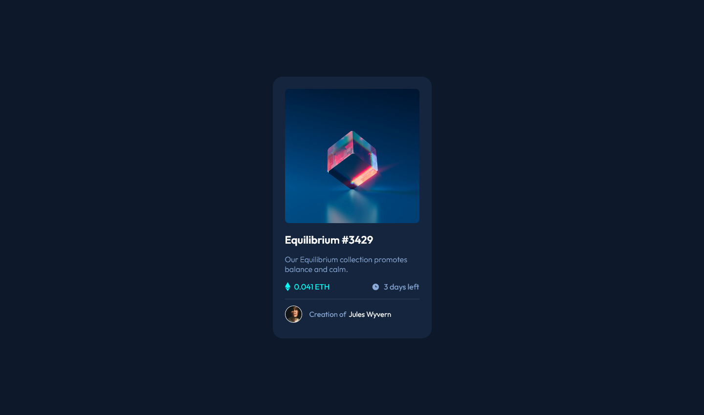
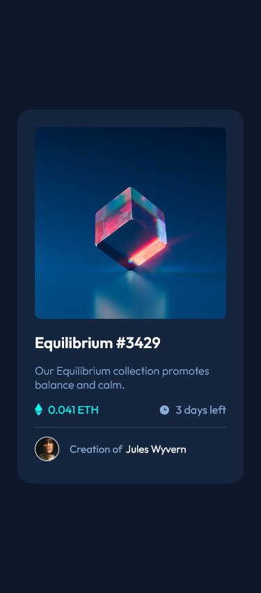

# Frontend Mentor - NFT preview card component solution

This is a solution to the [NFT preview card component challenge on Frontend Mentor](https://www.frontendmentor.io/challenges/nft-preview-card-component-SbdUL_w0U). Frontend Mentor challenges help you improve your coding skills by building realistic projects. 

## Table of contents

- [Overview](#overview)
  - [Screenshot](#screenshot)
  - [Links](#links)
- [My process](#my-process)
  - [Built with](#built-with)
- [Author](#author)

## Overview

This HTML & CSS only challenge is perfect for anyone just starting out or anyone wanting a small project to play around with.

### Screenshot

### Links

- Solution URL: [https://github.com/mohamedKhaled89/nft-preview-card-component]
- Live Site URL: [https://mohamedkhaled89.github.io/nft-preview-card-component/]

## My process

### Built with

- Semantic HTML5 markup
- CSS custom properties
- Flexbox
- CSS Grid

## Author

- Frontend Mentor - [@mohamedKhaled89](https://www.frontendmentor.io/profile/mohamedKhaled89)